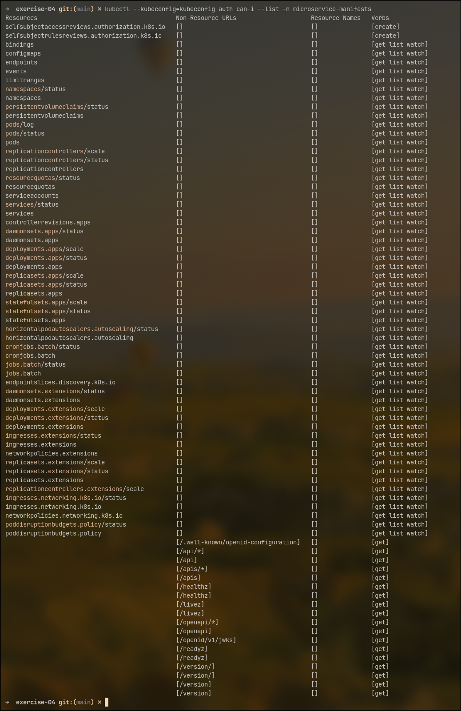

# Kubernetes Learning — Exercise 1

This section of the repository demonstrates how to create a multi-node Kubernetes cluster using Kind, deploy a namespace and a simple NGINX Pod, and expose it locally using kubectl port-forward.

## Requirements

- [Docker](https://www.docker.com/)
- [Kind](https://kind.sigs.k8s.io/)
- [Kubectl](https://kubernetes.io/docs/tasks/tools/)

## Project Structure

```text
.
├── exercise-01
│   ├── kind-cluster.yml
│   ├── ns.yml
│   └── pod.yml
```

## Cluster Setup with Kind

Make sure Docker is running, then create the cluster using the provided configuration file:

```bash
kind create cluster --name <cluster-name> --config exercise-01/kind-cluster.yml
```

Replace `<cluster-name>` with your desired cluster name.

This will create a multi-node cluster with:

- 1 control plane node
- 2 worker nodes
- Kubernetes version 1.26.6

Switch to the new context:

```bash
kubectl config use-context kind-<cluster-name>
```

Now you can verify the cluster setup:

```bash
kubectl get nodes
```

## Deploying Manifests

### Create a namespace:

```bash
kubectl apply -f exercise-01/ns.yml
```

Verify the namespace creation:

```bash
kubectl get ns
```

### Deploy an NGINX Pod:

```bash
kubectl apply -f exercise-01/pod.yml
```

Verify the Pod is running:

```bash
kubectl get pods -n <namespace>
```

## Exposing the Pod

```bash
kubectl port-forward pods/<pod-name> 8080:80 -n <namespace>
```

You can now access the NGINX server at `http://localhost:8080`. You should see the NGINX welcome page.

You should see output similar to:

```text
Forwarding from 127.0.0.1:8080 -> 80
Forwarding from [::1]:8080 -> 80
Handling connection for 8080
```

# Kubernetes Learning - Exercise 2

This section demonstrates how to deploy a Pod running NGINX, protected with Basic Authentication, using ConfigMap and Secret objects to inject the required configuration and credentials.

## Requirements

- [Docker](https://www.docker.com/)
- [Kind](https://kind.sigs.k8s.io/)
- [Kubectl](https://kubernetes.io/docs/tasks/tools/)
- [htpasswd](https://httpd.apache.org/docs/current/programs/htpasswd.html)
- [Base64](https://linux.die/base64/)

## Project Structure

```text
├── exercise-02
│   ├── default.yml
│   ├── htpasswd.yml
│   ├── ns.yml
│   └── pod.yml
```

## Deploying Manifests

### Create a namespace:

```bash
kubectl apply -f exercise-02/ns.yml
```

### Create the Secret for Basic Authentication:

```bash
kubectl apply -f exercise-02/htpasswd.yml
```

This Secret contains the username and password for Basic Authentication in stringData format and will be encoded in base64 when applied.

You can generate the password using the `htpasswd` command:

```bash
htpasswd -nbB <username> <password>
```

To verify the Secret creation, run:

```bash
kubectl get secrets -n <namespace>
kubectl describe secrets <secret-name> -n <namespace>
```

### Create the ConfigMap for NGINX configuration:

```bash
kubectl apply -f exercise-02/default.yml
```

This ConfigMap contains the NGINX configuration that enables Basic Authentication for the `/` location.

To verify the ConfigMap creation, run:

```bash
kubectl get configmaps -n <namespace>
kubectl describe configmaps <configmap-name> -n <namespace>
```

### Deploy the NGINX Pod:

```bash
kubectl apply -f exercise-02/pod.yml
```

The secret and configmap are mounted into the Pod in projected volume type, allowing NGINX to access the credentials and configuration. This mount type is useful for injecting multiple secrets and configmaps into a single volume. It also allows for dynamic updates to the secrets and configmaps without needing to restart the Pod.

To verify the Pod is running, run:

```bash
kubectl get pods -n <namespace> -o wide
```

## Accessing the NGINX Pod

You can access the NGINX Pod using port-forwarding:

```bash
kubectl port-forward pods/<pod-name> 8080:80 -n <namespace>
```

Now you can access the NGINX server at `http://localhost:8080`. When you try to access it, you should be prompted for a username and password. Use the credentials you set in the Secret.

# Kubernetes Learning - Exercise 3.1

In this exercise, we deploy a fullstack application (frontend + backend + PostgreSQL) into a Kubernetes cluster created with Kind. Docker images are pulled from a private Docker registry, and the application is exposed using Ingress NGINX.

## Requirements

- A working Kubernetes cluster (Kind)
- [Docker](https://www.docker.com/)
- [Kubectl](https://kubernetes.io/docs/tasks/tools/)
- Your own private Docker registry (e.g., dr.simbirsoft1.com/study/devops/<your_login> or Docker Hub private repo)

## Project Structure

```text
├── exercise-03
│   ├── backend.yml
│   ├── frontend.yml
│   ├── postgresql.yml
│   ├── ingress.yml
│   ├── ns.yml
```

## Deploying Manifests

### Create a namespace:

```bash
kubectl apply -f exercise-03/ns.yml
```

This will create the microservice-manifests namespace and attach required annotations and labels.

### Create `imagePullSecrets`:

Since we're pulling from a private registry, you must create an image pull secret before deploying workloads:

```bash
kubectl create secret docker-registry regcred \
  --docker-server=https://index.docker.io/v1/ \
  --docker-username=andreystryukov \
  --docker-password=<ваш-пароль> \
  --docker-email=<ваш-email> \
  --namespace=microservice-manifests
```

Make sure the imagePullSecrets field is referenced in your deployments.

### Deploy PostgreSQL:

```bash
kubectl apply -f exercise-03/postgresql.yml
```

This manifest includes:

- A StatefulSet running PostgreSQL (no persistent storage required)
- A Secret for database credentials
- A Headless Service for internal access

### Deploy Backend:

```bash
kubectl apply -f exercise-03/backend.yml
```

This manifest includes:

- A backend application
- A Kubernetes Secret for backend environment variables
- A Service to expose it inside the cluster

### Deploy Frontend:

```bash
kubectl apply -f exercise-03/frontend.yml
```

This manifest includes:

- A frontend application
- A Service to expose it inside the cluster

Both frontend and backend images must be available in your private Docker registry.

### Install Ingress NGINX:

You can use the official deployment example from Kind:

```bash
kubectl apply -f https://kind.sigs.k8s.io/examples/ingress/deploy-ingress-nginx.yaml
```

#### Optional: Bind Ingress to a Dedicated Node

If you want to bind the Ingress controller to a specific node before deploying it, you can label the node as follows:

```bash
kubectl label node <node-name> ingress-ready=true
```

Then, modify the Ingress NGINX deployment to include a node selector:

```yaml
spec:
  template:
    spec:
      nodeSelector:
        ingress-ready: "true"
```

Or patch the deployment after creation:

```bash
kubectl patch deployment ingress-nginx-controller -n ingress-nginx \
--patch '{"spec":{"template":{"spec":{"nodeSelector":{"ingress-ready":"true"}}}}}'
```

#### Optional: Add taint to node and toleration to ingress

To ensure only Ingress pods run on that node:

```bash
kubectl taint nodes <node-name> ingress-only=true:NoSchedule
```

Then, add a toleration to the Ingress NGINX deployment:

```yaml
spec:
  template:
    spec:
      tolerations:
        - key: "ingress-only"
          operator: "Equal"
          value: "true"
          effect: "NoSchedule"
```

#### Optional: Expose ports in cluster

To expose the Ingress controller ports in the cluster, you can add extra ports mappings to the cluster configuration:

```yaml
nodes:
  - role: worker
    extraPortMappings:
      - containerPort: 80
        hostPort: 80
        protocol: TCP
      - containerPort: 443
        hostPort: 443
        protocol: TCP
```

### Apply Ingress Manifest:

```bash
kubectl apply -f exercise-03/ingress.yml
```

This ingress manifest will route traffic to the frontend service on path `/` and to the backend service on path `/api`. The hostname `myapp.localhost` is used for local development.

## Accessing the Application

To access the application, you can use port-forwarding or configure your local DNS to resolve `myapp.localhost` to your Kind cluster's IP address.

### Port Forwarding

```bash
kubectl port-forward svc/ingress-nginx-controller 80:80 -n ingress-nginx
```

Now you can access the frontend at `http://localhost/` and the backend at `http://localhost/api`.

### DNS Configuration

To access the application using the hostname `myapp.localhost`, you can add an entry to your `/etc/hosts` file:

```text
127.0.0.1 myapp.localhost
```

Now you can access the frontend at `http://myapp.localhost/` and the backend at `http://myapp.localhost/api`.

## Scalability

Both frontend and backend Deployments are designed to scale. You can increase replicas without breaking the application:

```bash
kubectl scale deployment frontend --replicas=3 -n microservice-manifests
kubectl scale deployment backend --replicas=3 -n microservice-manifests
```

# Kubernetes Learning - Exercise 3.2

This exercise demonstrates how to persist data for both a PostgreSQL database and a backend application using Rancher's local-path-provisioner.

## Requirements

- A working Kubernetes cluster (Kind)
- [Docker](https://www.docker.com/)
- [Kubectl](https://kubernetes.io/docs/tasks/tools/)

## Project Structure

```text
├── exercise-03
│   ├── backend.yml
│   ├── frontend.yml
│   ├── ingress.yml
│   ├── ns.yml
│   ├── postgresql.yml
│   └── pvc.yml
```

## Deploying Manifests

### Install Local Path Provisioner

To enable dynamic provisioning of PersistentVolumes in a Kind cluster, install `local-path-provisioner` using the following command:

```bash
kubectl apply -f https://raw.githubusercontent.com/rancher/local-path-provisioner/v0.0.31/deploy/local-path-storage.yaml
```

Verify the installation:

```bash
kubectl get pods -n local-path-storage
```

This deploys a StorageClass named local-path and sets it as the default. It provisions PVCs by creating directories on the node's filesystem.

### Create PersistentVolumeClaims

Create a PersistentVolumeClaim for PostgreSQL and the backend application:

```bash
kubectl apply -f exercise-03/pvc.yml
```

## Recomendations for Real-World Usage

### Backend Application

The backend in this example is deployed with a persistent volume for the sake of this exercise. However, in a real-world scenario, if the application is stateless (e.g., stores no local data), persistent storage is not required and should be avoided to keep the architecture simpler and more scalable.

### PostgreSQL Database

In a real Kubernetes cluster, it is highly recommended to deploy PostgreSQL using a **StatefulSet** with `volumeClaimTemplates`. This approach ensures that each database instance receives a dedicated persistent volume, providing stable network identities and persistent storage binding for each Pod. This is especially important when running multiple databases, as using a single PVC for all instances can lead to data corruption and loss of isolation.

Additionally, you must carefully design your storage and database deployment to support proper replication and synchronization between database instances. Kubernetes itself does **not** provide built-in mechanisms for database replication, consistency, or failover. These aspects should be managed by the database system (e.g., PostgreSQL streaming replication, Patroni, or similar tools) and the underlying storage solution must support the required consistency guarantees for your use case.

# Kubernetes Learning - Exercise 3.3

This exercise focuses on implementing Kubernetes NetworkPolicy rules to isolate traffic between components of a microservices application.

## Requirements

- A working Kubernetes cluster (Kind)
- [Docker](https://www.docker.com/)
- [Kubectl](https://kubernetes.io/docs/tasks/tools/)

## Project Structure

```text
├── exercise-03
│   ├── backend.yml
│   ├── frontend.yml
│   ├── ingress.yml
│   ├── network-policy.yml
│   ├── ns.yml
│   ├── postgresql.yml
│   └── pvc.yml
```

## Setup

Before applying the NetworkPolicies, make sure your cluster supports them. In this setup, [Calico](https://docs.tigera.io/calico/latest/getting-started/kubernetes/kind) was used as the CNI plugin to enable network policy enforcement.

> **Note:** NetworkPolicies are only enforced if a CNI plugin that supports them is installed. Kind does not enforce NetworkPolicies by default, so you must install a compatible CNI plugin like Calico or Cilium.

If you're using Kind, disable the default CNI and configure the pod subnet to match Calico requirements:

```yaml
networking:
  disableDefaultCNI: true
  podSubnet: "192.168.0.0/16"
```

### Calico Installation

To install Calico in your Kind cluster, run the following command:

```bash
kubectl apply -f https://raw.githubusercontent.com/projectcalico/calico/v3.30.2/manifests/calico.yaml
```

You can verify Calico installation in your cluster by issuing the following command.

```bash
watch kubectl get pods -l k8s-app=calico-node -A
```

Wait until all pods are in the Running state.

## Deploying Manifests

### Apply NetworkPolicy

```bash
kubectl apply -f exercise-03/network-policy.yml
```

Make sure the Pods for frontend, backend, and PostgreSQL are already deployed in the appropriate namespace before applying the policy.

## Testing NetworkPolicy

To test the NetworkPolicy, you can use a temporary Pod to simulate traffic between the components. Create a temporary Pod in the same namespace:

```bash
kubectl run -n microservice-manifests -it --rm --restart=Never test-pod --image=postgres:alpine -- sh
```

Inside the test Pod, you can use `wget` or `curl` to test connectivity:

```bash
# Test connectivity to the frontend
wget -qO- http://frontend-svc
# Test connectivity to the backend
wget -qO- http://backend-svc:8081/api/ping
# Test connectivity to PostgreSQL
psql -h postgres-0.postgres-svc -U app -d app # Make sure to provide the password (dbpassword) when prompted
```

## Additional Notes

- These policies enforce zero-trust by default: all traffic is denied unless explicitly allowed.
- Ingress traffic to the frontend/backend is restricted to the source Pods labeled as part of the Ingress Controller.
- Access to the PostgreSQL Pod is only permitted from backend Pods using specific label selectors.

# Kubernetes Learning - Exercise 3.4

This exercise demonstrates how to create a Kubernetes Job that runs a database migration script before the backend application starts. The Job will run only once and will fail if the migration script encounters any errors.

## Solution Overview

Our backend is written in Go and compiled into a static binary. This binary supports running database migrations automatically if the `RUN_MIGRATION=true` environment variable is set.

However, it is not possible to run the migration in isolation (i.e., as a CLI argument or a separate command) without launching the full application. Therefore, if we attempt to use this binary in a Job, the process hangs or crashes due to the nature of long-lived application behavior and the Kubernetes job timeout mechanism.

To reflect the requirement of this exercise, two approaches are demonstrated:

1. Job using Go-based backend (not recommended in production):

A Job is created using the same Go backend image with RUN_MIGRATION=true. However, this Job fails and is not suitable for production due to the limitations mentioned above. It is included only to fulfill the assignment conditions.

When run in a Job, the application performs the migration but does not exit, causing the Job to fail due to timeout.

While it is possible to override the container's entrypoint to simulate a workaround (e.g., waiting for log output), this was considered an unreliable and fragile solution

2. Job using custom Flask-based migration utility:

To provide a functional and proper solution, a separate Docker image was built: `andreystryukov/utilities:flask-migrate-1.0.0`

This image includes a minimal Flask application and uses `flask db init` and `flask db upgrade` to run Alembic migrations.

The SQLAlchemy models are passed into the container via a ConfigMap that includes the `models.py` file.

The Job mounts this ConfigMap and executes the migration logic successfully.

> **Note:** Note: The Flask migration Job requires persistent storage for Alembic to manage version history and metadata. Running the job multiple times without storage can cause errors, such as Alembic version mismatch. To prevent this, a PersistentVolumeClaim should be mounted into the container at the appropriate location (e.g. /app/migrations).

## Project Structure

```text
├── exercise-03
│   ├── backend.yml
│   ├── flask-migrations-pvc.yml
│   ├── frontend.yml
│   ├── ingress-nginx.yml
│   ├── ingress.yml
│   ├── job-flask.yml
│   ├── job.yml
│   ├── network-policy.yml
│   ├── ns.yml
│   ├── postgresql.yml
│   └── pvc.yml
```

## Deploying Manifests

### Apply the Job using Go-based backend (not recommended):

```bash
kubectl apply -f exercise-03/job.yml
```

This Job will run the backend application with the `RUN_MIGRATION=true` environment variable set. It is expected to fail due to the reasons mentioned above.

### Apply the Job using Flask-based migration utility:

First apply the PVC for the Flask migration utility:

```bash
kubectl apply -f exercise-03/flask-migrations-pvc.yml
```

```bash
kubectl apply -f exercise-03/job-flask.yml
```

This Job will run the Flask application with the migration logic. It mounts the ConfigMap containing the SQLAlchemy models and executes the migration commands.

To verify the Job status, run:

```bash
kubectl get jobs -n microservice-manifests
kubectl describe job <job-name> -n microservice-manifests
kubectl logs job/<job-name> -n microservice-manifests
```

# Kubernetes Learning - Exercise 3.5

This exercise demonstrates implementation of resource control, health checks, and autoscaling for frontend and backend components in a Kubernetes cluster.

## Requirements

- A working Kubernetes cluster (Kind)
- [Docker](https://www.docker.com/)
- [Kubectl](https://kubernetes.io/docs/tasks/tools/)

## Project Structure

```text
├── exercise-03
│   ├── backend.yml
│   ├── flask-migrations-pvc.yml
│   ├── frontend.yml
│   ├── hpa.yml
│   ├── ingress.yml
│   ├── job-flask.yml
│   ├── job.yml
│   ├── kind-cluster.yml
│   ├── network-policy.yml
│   ├── ns.yml
│   ├── postgresql.yml
│   └── pvc.yml
```

## Deploying Manifests

### Apply Horizontal Pod Autoscaler (HPA)

```bash
kubectl apply -f exercise-03/hpa.yml
```

## What was done

### Health Checks (probes)

1. Frontend:

- startupProbe: HTTP GET /
- readinessProbe: HTTP GET /
- livenessProbe: TCP socket check on port 80

Tuned for fast detection using high failureThreshold and low initialDelaySeconds.

2. Backend:

- startupProbe: HTTP GET /api/ping
- readinessProbe: HTTP GET /api/ping
- livenessProbe: TCP socket check on port 8081

Additionally, a separate init container was added to the backend to wait for PostgreSQL readiness using pg_isready.

### Resource Control

Defined requests and limits for both apps.
Backend has equal values for requests and limits to ensure stable performance.
Frontend has lower requests than limits to allow for horizontal scaling.

### Cluster configuration

Updated kind-cluster.yml to include 4 worker nodes.

### Horizontal Pod Autoscaler (HPA)

Configured hpa.yml to scale frontend pods from 1 to 3 replicas based on CPU usage.

### Anti-Affinity Rules

Frontend pods are scheduled only on different nodes using podAntiAffinity

## Testing

To watch metrics and scaling behavior, you need to have the metrics server installed in your cluster. You can install it using the following command:

```bash
kubectl apply -f https://github.com/kubernetes-sigs/metrics-server/releases/latest/download/components.yaml
```

If you encounter issues with the metrics server, you may need to patch it to allow insecure TLS connections to the kubelet. This is often necessary in Kind clusters where the kubelet does not have a valid certificate.

```bash
kubectl patch deployment metrics-server -n kube-system \
    --type='json' \
    -p='[{"op": "add", "path": "/spec/template/spec/containers/0/args/-", "value": "--kubelet-insecure-tls"}]'
```

You can monitor resource usage using the following command:

```bash
watch -n 2 "kubectl top pods -n microservice-manifests -l app=frontend"
```

To perform a load test, you can use a tool like `bombardier`. For example, to simulate 100,000 requests with 125 concurrent users, run the following command:

```bash
bombardier -c 125 -n 100000 http://myapp.localhost
```

This will generate load on the frontend service, causing the HPA to scale the number of replicas based on CPU usage.

To view your cluster in real time, you can use the `k9s` tool.

```bash
k9s
```

# Kubernetes Learning - Exercise 4

This task demonstrates the creation of a `ServiceAccount` with read-only access to a specific namespace.

## Requirements

- A working Kubernetes cluster (Kind)
- [Docker](https://www.docker.com/)
- [Kubectl](https://kubernetes.io/docs/tasks/tools/)

## Project Structure

```text
├── exercise-04
│   ├── kubeconfig
│   └── rbac-auditor.yml
```

## Deploying Manifests

### Create the ServiceAccount and RoleBinding

```bash
kubectl apply -f exercise-04/rbac-auditor.yml
```

This manifest creates a `ServiceAccount` named `rbac-auditor` in the `microservice-manifests` namespace, along with a `ClusterRole` "view" that grants read-only access to all resources in the cluster. The `RoleBinding` binds the `rbac-auditor` ServiceAccount to the "view" ClusterRole.

## Creating a Kubeconfig File

To create a kubeconfig file for the `rbac-auditor` ServiceAccount, you need to extract the token:

```bash
TOKEN=$(kubectl create token auditor -n microservice-manifests)
```

Then, get api server URL and CA certificate:

```bash
APISERVER=$(kubectl config view --minify -o jsonpath='{.clusters[0].cluster.server}')
CA_CERT=$(kubectl config view --minify --flatten -o jsonpath='{.clusters[0].cluster.certificate-authority-data}')
```

Now, create the kubeconfig file:

```bash
cat > kubeconfig <<EOF
apiVersion: v1
kind: Config
clusters:
- name: kubernetes
  cluster:
    certificate-authority-data: ${CA_CERT}
    server: ${APISERVER}
contexts:
- name: auditor-context
  context:
    cluster: kubernetes
    namespace: microservice-manifests
    user: auditor
current-context: auditor-context
users:
- name: auditor
  user:
    token: ${TOKEN}
EOF
```

## Verifying Access

You can verify that the `rbac-auditor` ServiceAccount has read-only access to the namespace by using the kubeconfig file you created:

```bash
kubectl --kubeconfig=kubeconfig auth can-i --list -n microservice-manifests
```

Alternatively, you can use the `kubectl auth can-i` command to check permissions directly:

```bash
kubectl auth can-i --as=system:serviceaccount:microservice-manifests:auditor --list -n microservice-manifests
```



## Notes on Security

Creating long-lived tokens is not recommended for production environments. Ideally, user authentication is delegated to an external identity provider (such as OIDC or LDAP). ServiceAccounts should primarily be used by in-cluster applications with short-lived tokens managed by Kubernetes.

If user access is required, consider issuing signed client certificates or configuring an external auth system instead of exposing service account credentials.

# Kubernetes Learning - Exercise 5

This exercise focuses on migrating the deployment manifests of the frontend and backend services into Helm charts. The PostgreSQL database is included as a dependency via the official Bitnami Helm chart.

## Requirements

- A working Kubernetes cluster (Kind)
- [Docker](https://www.docker.com/)
- [Kubectl](https://kubernetes.io/docs/tasks/tools/)
- [Helm](https://helm.sh/docs/intro/install/)

## Prerequisites

Before installing the charts, make sure the following components are installed and configured in the cluster:

- calico (for NetworkPolicy support)
- local-path-provisioner (for dynamic volume provisioning)
- ingress-nginx (for exposing the frontend over HTTP)
- The target namespace (e.g., microservice-manifests) should be created manually:

```bash
kubectl create namespace microservice-manifests
```

## Project Structure

```text
├── exercise-05
│   ├── backend
│   │   ├── Chart.lock
│   │   ├── charts
│   │   │   └── postgresql-16.7.20.tgz
│   │   ├── Chart.yaml
│   │   ├── templates
│   │   │   ├── deployment.yaml
│   │   │   ├── flask-migration-configmap.yml
│   │   │   ├── flask-migration-job.yaml
│   │   │   ├── flask-migration-pvc.yml
│   │   │   ├── _helpers.tpl
│   │   │   ├── job.yaml
│   │   │   ├── pvc.yaml
│   │   │   ├── secret.yaml
│   │   │   └── svc.yaml
│   │   └── values.yaml
│   └── frontend
│       ├── Chart.yaml
│       ├── templates
│       │   ├── deployment.yaml
│       │   ├── _helpers.tpl
│       │   ├── hpa.yaml
│       │   ├── ingress.yaml
│       │   ├── networkpolicy.yaml
│       │   └── svc.yaml
│       └── values.yaml
```

Both frontend and backend charts contain templated Kubernetes manifests using Go templates and default configuration via values.yaml.
The backend chart includes the PostgreSQL chart as a subchart (charts/postgresql-16.7.20.tgz) from Bitnami, as well as migration logic executed via Job as post-install hook.

> **Note:** Note: The Flask migration Job requires persistent storage to work correctly. Without a shared volume, repeated invocations may fail due to Alembic version inconsistencies in the database.

## Installation

```bash
helm install frontend exercise-05/frontend --namespace microservice-manifests
helm install backend exercise-05/backend --namespace microservice-manifests
```

To uninstall the charts, run:

```bash
helm uninstall frontend --namespace microservice-manifests
helm uninstall backend --namespace microservice-manifests
```
